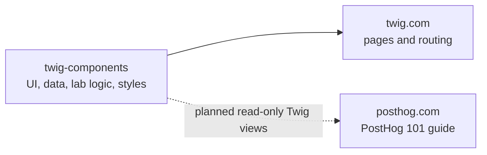

# Twig components

`@posthog/twig-components` holds reusable pieces of the fictional Twig travel site and its PostHog playground. It is a React package, not a complete website.

| Need | Start here |
| --- | --- |
| Find a component, its purpose, props, and current use | [Component reference](docs/components.md) |
| Decide which repo to change for a new lab or guide | [Integration and authoring scenarios](docs/integration.md#authoring-scenarios) |
| Understand package setup and updates | [Integration and updates](docs/integration.md) |
| See the components | `npm run gallery`, then open `gallery/output/index.html` |

## How it fits



**Current status:** Twig.com imports a local workspace copy of this package. The standalone package is not published to npm. PostHog 101 does not yet import it. See [integration and updates](docs/integration.md) before changing either site.

## Quick example

`BrowseStaysPreview` is a static Twig excerpt for an article. `selected` controls which filter and stay it shows; it does not handle clicks or record events.

```tsx
import { BrowseStaysPreview } from "@posthog/twig-components/browse-stays-preview";
import "@posthog/twig-components/catalog.css";

<BrowseStaysPreview selected="Coast" />;
```

For the interactive website filters, use [`StayFilters`](docs/components.md#website-views-and-data) instead. For the five teaching labs and playground shell, see [labs and playground](docs/components.md#labs-and-playground).

## Work locally

```sh
npm ci
npm test
npm run gallery
npm pack --dry-run
```

`npm test` builds the package and runs its tests. The gallery renders real package exports for visual review. `npm pack --dry-run` lists the files a release would contain. Changes here do not update either website automatically.
