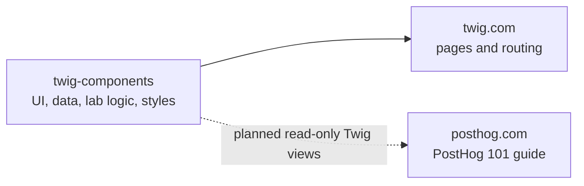

# Twig components

`@posthog/twig-components` holds reusable pieces of the fictional Twig travel site and its PostHog playground. It is a React package, not a complete website.

| Need | Start here |
| --- | --- |
| Find a component, its purpose, props, and current use | [Component reference](docs/components.md) |
| Contribute with a coding agent | [Agent guidance](AGENTS.md) |
| Report a security issue | [Private vulnerability reporting](https://github.com/PostHog/twig-components/security/advisories/new) |
| Decide which repo to change for a new lab or guide | [Integration and authoring scenarios](docs/integration.md#authoring-scenarios) |
| Understand package setup and updates | [Integration and updates](docs/integration.md) |
| Develop and click through components | [Workbench guide](docs/workbench.md) |
| See static release snapshots | `npm run gallery`, then open `gallery/output/index.html` |

## How it fits



Twig.com installs a published version of this package. After changing shared components, release a new version and update each site that needs it. See [integration and updates](docs/integration.md) for the steps.

## Quick example

`BrowseStaysPreview` is a static Twig excerpt for an article. `selected` controls which filter and stay it shows; it does not handle clicks or record events.

```tsx
import { BrowseStaysPreview } from "@posthog/twig-components/browse-stays-preview";
import "@posthog/twig-components/catalog.css";

<BrowseStaysPreview selected="Coast" />;
```

For the interactive website filters, use [`StayFilters`](docs/components.md#website-views-and-data) instead. For the five teaching labs and playground shell, see [labs and playground](docs/components.md#labs-and-playground).

## Work locally

```sh
npm ci
npm run workbench
```

Open the URL printed in the terminal. The workbench shows Twig views and all five labs, with local fixtures you can click through. See the [workbench guide](docs/workbench.md) for adding a component or lab preview. The gallery remains a static snapshot for release review.

Before asking for review:

```sh
npm test
npm run workbench:build
npm run gallery
npm pack --dry-run
```

`npm test` builds the package and runs its tests. `workbench:build` checks the live preview. `npm pack --dry-run` lists the files a release would contain. Changes here do not update either website automatically.
